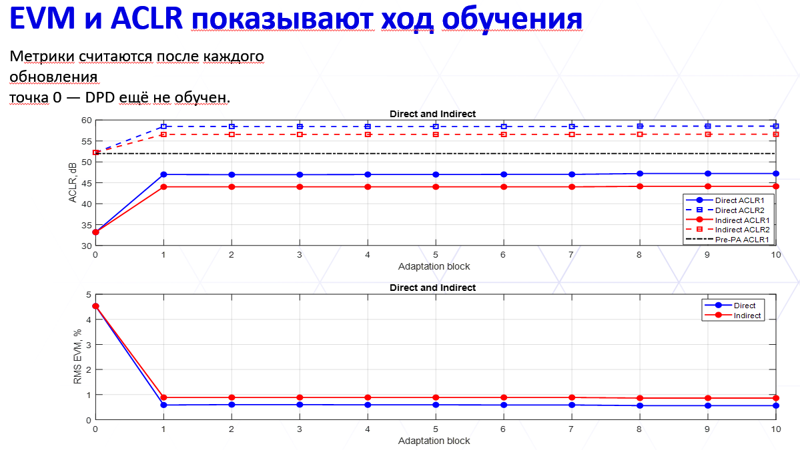
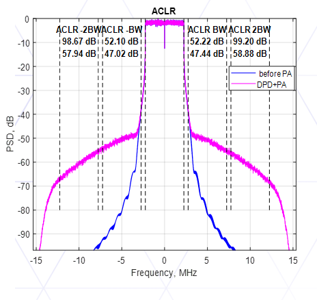
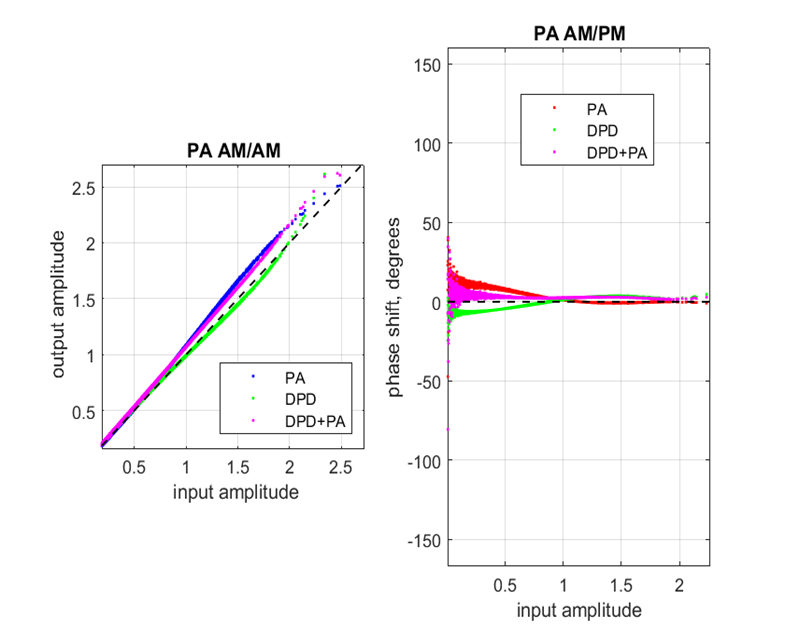
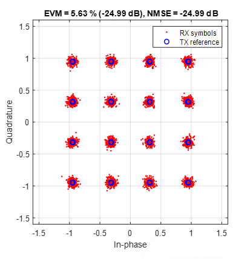
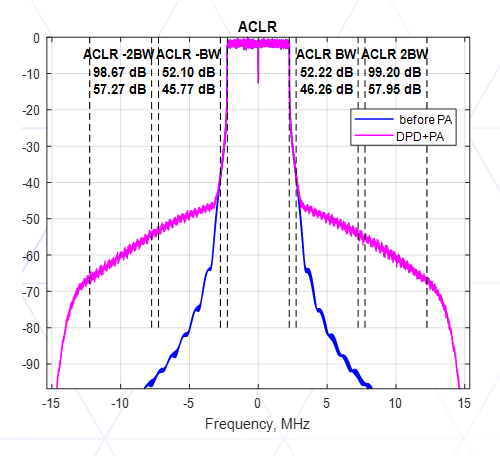
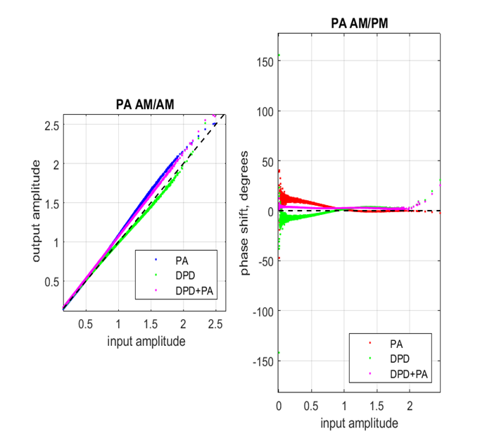
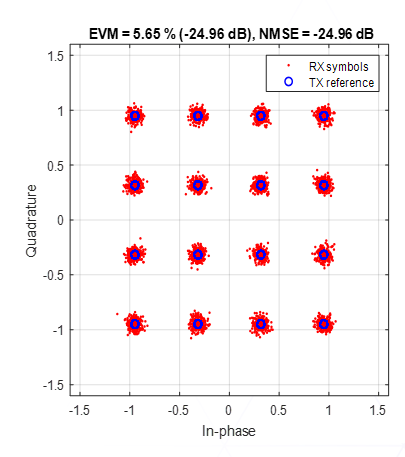

# DPD research

Исследование цифрового предыскажения (DPD) OFDM-сигнала в MATLAB. Цель работы: компенсация нелинейных искажений усилителя мощности и сравнение двух архитектур обучения, DLA и ILA.

Предыскажатель изменяет сигнал перед усилителем так, чтобы выход каскада DPD+PA был ближе к линейно усиленному исходному сигналу. Результат оценивается по спектру, излучению в соседних каналах и ошибке восстановления сигнала.

## Алгоритмы DPD

**DLA (Direct Learning Architecture), прямое обучение.** Коэффициенты предыскажателя обновляются по ошибке между выходом каскада DPD+PA и эталонным сигналом с заданным усилением. В стенде для расчёта обновлений используются производные модели PA, регуляризация и подбор шага. Таким образом, обучение непосредственно направлено на уменьшение ошибки всего каскада.

**ILA (Indirect Learning Architecture), косвенное обучение.** По выходу PA с учётом опорного усиления обучается обратная модель, которая восстанавливает сигнал на входе усилителя. Её коэффициенты затем переносятся в предыскажатель перед PA. Обучение выполняется по блокам с регуляризацией Тихонова и проверкой предлагаемых обновлений.

## Характеристики стенда

- OFDM 16-QAM: канал 5 МГц, частота дискретизации 30,72 МГц, циклический префикс и WOLA.
- Усилитель: GMP-модель с коэффициентами, идентифицированными по измеренным входу и выходу PA.
- Интерполяция в 24 раза до 737,28 МГц и обратная децимация с КИХ-фильтрацией.
- Канал с аддитивным белым гауссовским шумом (AWGN).
- Спектр методом Welch, ACLR, EVM, NMSE, PAPR, созвездия, AM/AM и AM/PM.

## Результаты

### Ход обучения DLA и ILA

Поблочное изменение ACLR и RMS EVM: синие кривые соответствуют прямому обучению (DLA), красные косвенному (ILA). Верхний график показывает ACLR в первых и вторых соседних каналах, нижний показывает EVM.

В этом запуске основное улучшение достигается после первого блока, затем метрики меняются незначительно. DLA обеспечивает более высокий ACLR и более низкий EVM по сравнению с ILA.

### Прямое обучение (DLA)

Пример результатов запуска стенда с DPD на основе DLA.

**Спектр и ACLR.** Синий спектр соответствует сигналу до PA, пурпурный показывает выход каскада DPD+PA. Показаны уровни ACLR в соседних каналах.

**AM/AM и AM/PM.** Сравниваются характеристики усилителя PA, предыскажателя DPD и их каскада DPD+PA. Пунктиром отмечены единичная амплитудная характеристика и нулевой фазовый сдвиг.

**Созвездие 16-QAM.** Принятые символы RX показаны красным, эталонные символы TX обозначены синими окружностями.

### Косвенное обучение (ILA)

Пример результатов запуска стенда с DPD на основе ILA.

**Спектр и ACLR.** Синий спектр соответствует сигналу до PA, пурпурный показывает выход каскада DPD+PA. Показаны уровни ACLR в соседних каналах.

**AM/AM и AM/PM.** Сравниваются характеристики усилителя PA, предыскажателя DPD и их каскада DPD+PA. Пунктиром отмечены единичная амплитудная характеристика и нулевой фазовый сдвиг.

**Созвездие 16-QAM.** Принятые символы RX показаны красным, эталонные символы TX обозначены синими окружностями.

